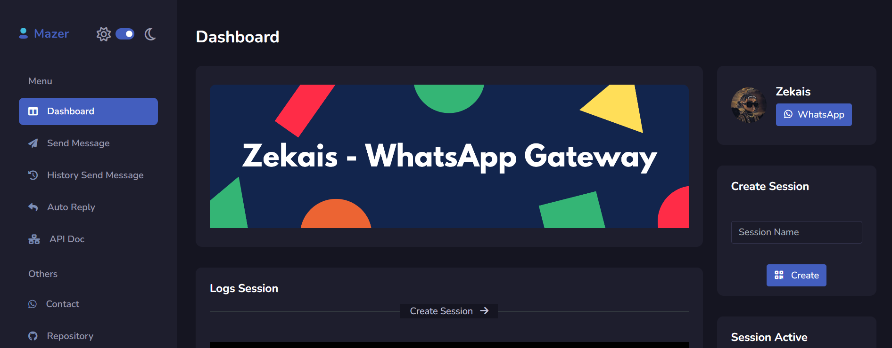

<div align="center">

# **WhatsApp - Gateway**



Simple WhatsApp Gateway, Built Using Baileys, Express, Sequelize + [Mazer](https://github.com/zuramai/mazer)

</div>

<p align="center">
<a href="https://github.com/fawwaz37/whatsapp-gateway/stargazers" target="_blank"></a>
<a href="https://github.com/fawwaz37/whatsapp-gateway/network/members" target="_blank"></a>
</p>

# Note

If you want to **request a feature**, contact my number wa.me/6287715579966

Because there are no other features added to this free repo

# Installation

Requirements

-   [Node.js](https://nodejs.org/en/)
-   [Git](https://git-scm.com/downloads)
-   [VS Code](https://code.visualstudio.com/download) or Any Text Editor

## Cloning this repo

```cmd
> git clone https://github.com/fawwaz37/whatsapp-gateway.git
> cd whatsapp-gateway
```

Use `code .` to open file in VS Code

```cmd
> code .
```

## Editing the file

`.env` Configurations

```env

# Listening Host - socket
HOST=http://localhost:8080

# Default session name
SESSION_NAME=session_1

# If AUTO_START=y, Auto Start Session With Default name
AUTO_START=n

# It doesn't need to be replaced, it's okay
PREFIX=.
SESSION_PATH=./session
LOG_PATH=./public/log

# Configure the database, fill it with your own
DB_NAME=wa-gateway
DB_USER=root
DB_PASSWORD=
DB_HOST=localhost
DB_PORT=3306
DB_DIALECT=mysql

```

## Installing the dependencies

```cmd
> npm install
```

## Running App

```cmd
> npm start
```

**After Start Database and Table Auto Create**

Then Browse http://localhost:8080 . You will see the Dashboard.


## API Docs

You Can See All Documentation Here <a target="_blank" href="https://documenter.getpostman.com/view/16528402/VVXC3EjU">POSTMAN</a>
